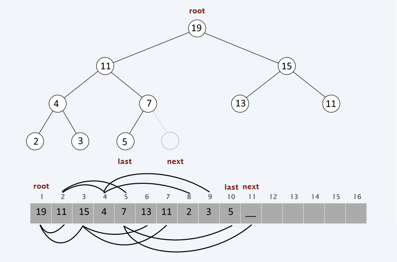

Упражнение 6
============

[Binary Heap (a.k.a Priority Queue)](https://en.wikipedia.org/wiki/Binary_heap)
------------------------------------

Източници:

- [статията в Wikipedia](https://en.wikipedia.org/wiki/Binary_heap)
- [The Algorithm Design Manual (S. Skiena), pages 83 & 109](https://edisciplinas.usp.br/pluginfile.php/1995283/mod_resource/content/1/Skiena.-.TheAlgorithmDesignManual.pdf)

  - **3.5 Priority Queues**, page 83
  - **4.3 Heapsort: Fast Sorting via Data Structures**, page 111

- [Algorithms, R. Sedgewick](https://github.com/haseebr/competitive-programming/blob/master/Materials/Algorithhms%204th%20Edition%20by%20Robert%20Sedgewick%2C%20Kevin%20Wayne.pdf)
  - **2.4 Priority Queues**, page 308

**def.** **Min**-heap е двоична пирамида,
при която всеки връх в нея е **по-малък** от децата си.

**def.** **Max**-heap е двоична пирамида,
при която всеки връх в нея е **по-голям** от децата си.

Задачи
------

0. Реализирайте приоритетна опашка, като наследите класа `PriorityQueue`
и използвате двоична пирамида като логическа структура.
В следващите задачи ще работим с тази реализация, която можем да наречем `BinaryHeap`.
Имате избор между **min** и **max**-heap. Направете първо **min**-heap. A защо не и двете? :smiley:

1. Реализирайте предиката `void isMinHeap(const BinaryHeap& heap)`,
който проверява дали двоичната пирамида `heap` е **min-heap**,
тоест, че на върха винаги седи минималният елемент.
Може предикатът да е член-функция на вашата структура двоична пирамида, за да използвате физическите данни.

2. Реализирайте функцията `void heapSort(const vector<int>& numbers)`,
която сортира редицата от числа `numbers`,
използвайки двоична пирамида за целта.
Каква времева сложност има вашия алгоритъм?

3. Реализирайте функцията `void kthSmallest(const vector<int>& numbers)`,
която намира k-тия най-малък елемент в редицата от числа `numbers`.
Каква времева сложност има вашия алгоритъм?

4. Реализирайте стуктура от данни `Median`,
която съхранява редица от елементи и може да намира медианата на редицата.
Трябва да поддържа следните 2 операции:

   - `void insert(T item)`, която вмъква елемент

   - `T median()`, която намира медианата на редицата

   Каква времева сложност имат двете операции във вашата реализация?

   Каква е сложността по памет?

   Как бихте оптимизирали вашето решение с приоритетна опашка?

   **def. Медиана** на редица от числа `[a1, a2, ..., aN]` с N елемента e средата на сортираната редица:

   - когато `N` е нечетно число, медианата е средният елемент на позиция `N / 2` в сортираната редица.

   - когато `N` е четно число, медианата е средно-аритметичното на двата средни елемента в сортираната редица.

      Например, медианата на редицата `[8, 4, 9, 2, 2, 3, 1, 13]` е `3.5`,
      защото двата средни елемента в сортираната редица са `3` и `4` - [1, 2, 2, **3**, **4**, 8, 9, 13].
